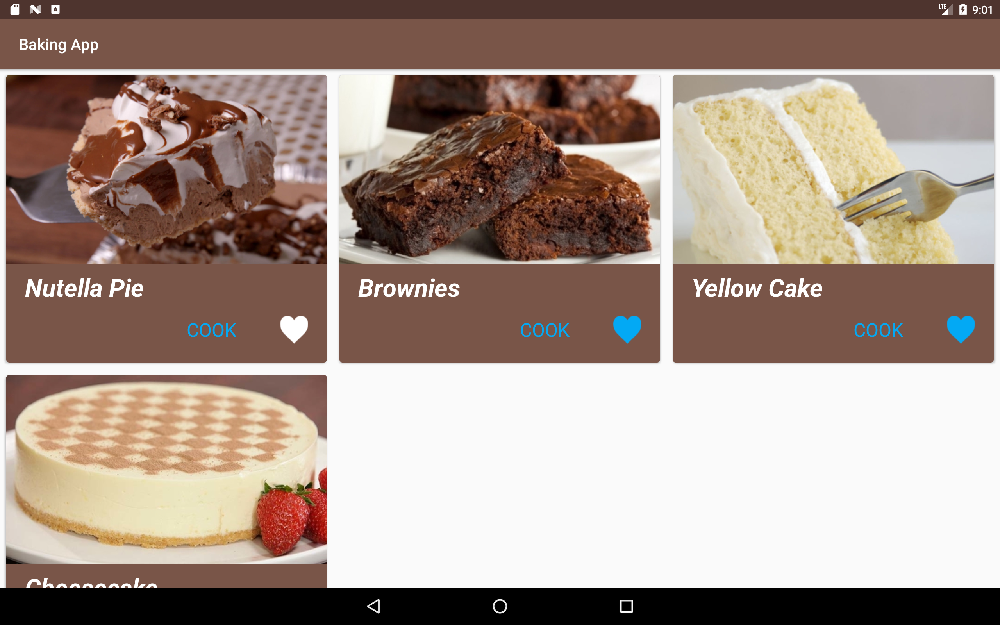
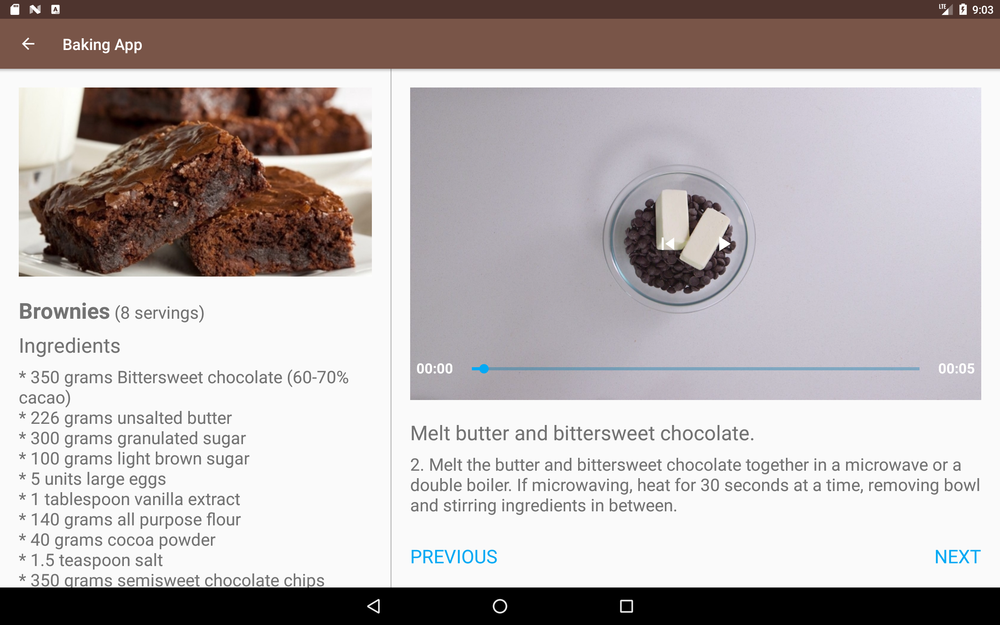

# BakingAppProject

Baking App - Android Development Nanodegree by Google (Project 3)

BakingApp project is a part of Android Development Nanodegree by Google.

Screenshots:

Phone

Tablet, portrait

Tablet, landscape

Description:

BakingApp displays recipes from the network resource provided by Udacity. 

The RecipesFragment displays a list of recipes. Every recipe CardView has an image, recipe name, a button "COOK" which 
opens RecipeDetailFragment and a heart-shaped ToggleButton which adds recipe ingredients to the widget.

The RecipeDetailFragment displays an image, recipe name, number of servings, ingredients and 
a list of short step descriptions how to prepare the chosen meal. When an item from the step list is clicked, 

RecipeStepFragment opens displaying information related to the corresponding step: short description, full description
and a video/picture or an empty view explaining that there is no video for the chosen step.
RecipeStepFragment allows navigation to the previous and next step.

The layout for tablets employs Master Detail navigation flow.

This application uses the following libraries:

* Volley
* Schematic
* ExoPlayer
* Butter Knife
* Picasso
* Gson

I made this project to learn how to:

1) create and update a widget for an application 
2) apply fragments to create a responsive layout
3) use ExoPlayer to show videos
4) test applications with Espresso
5) pass an object in a bundle from one Activity to another
6) use CardView
7) apply third-party libraries: Volley, Schematic, Gson
